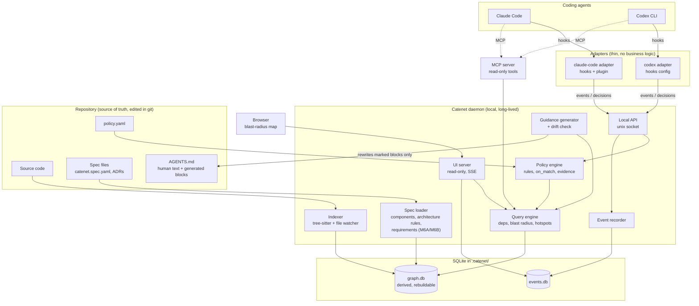
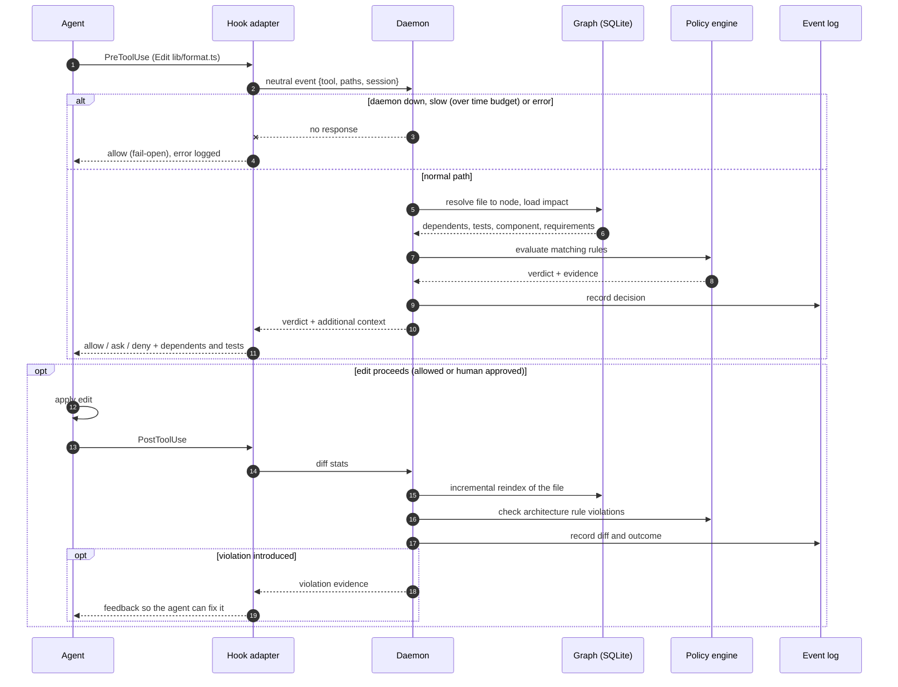
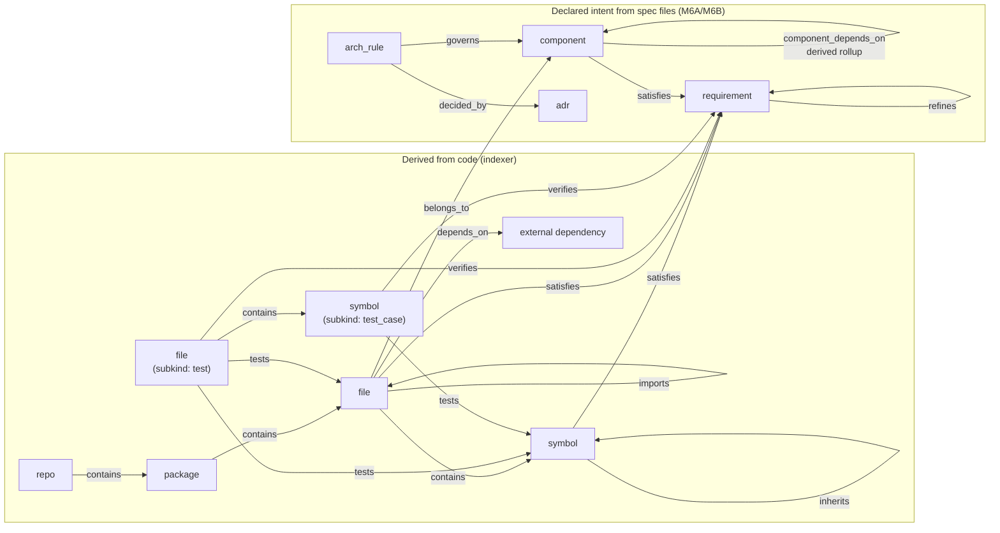
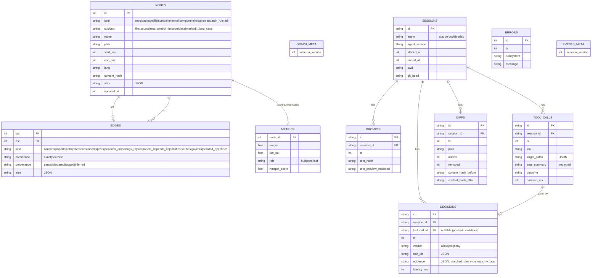
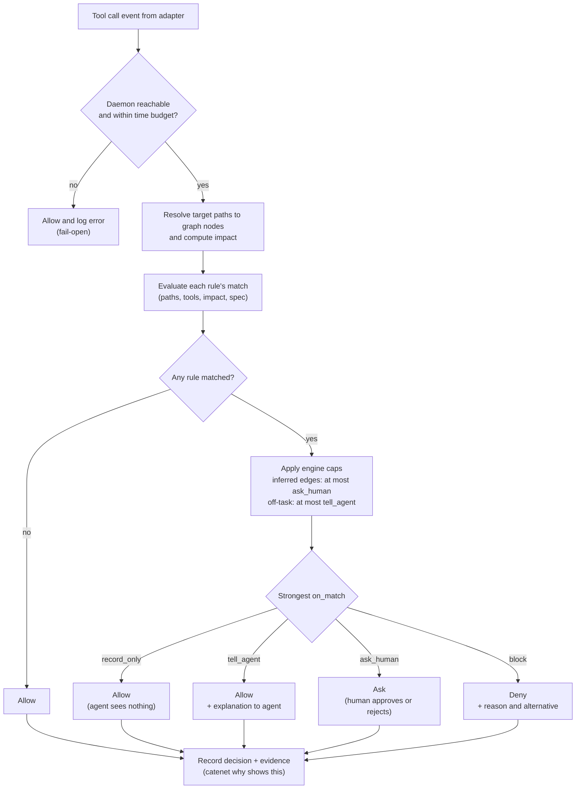
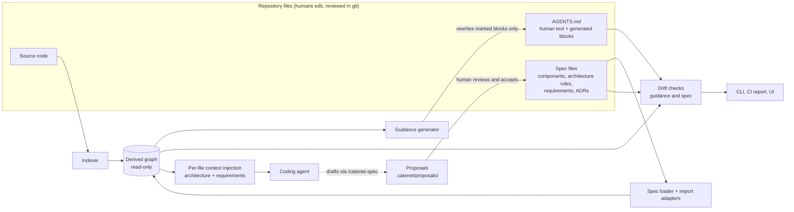
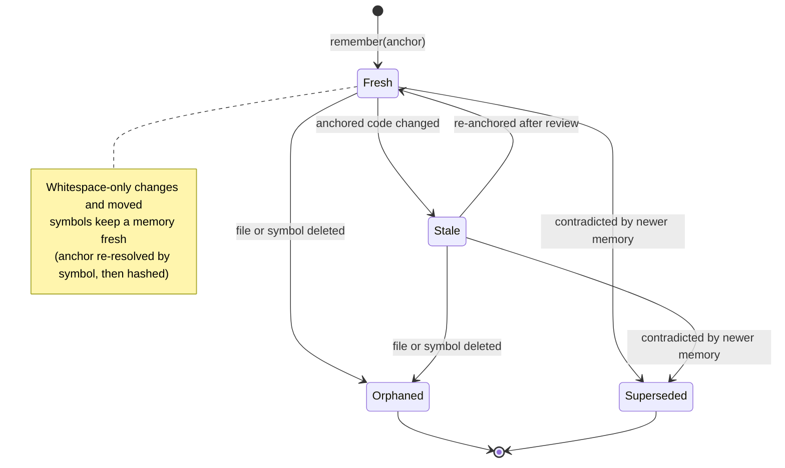
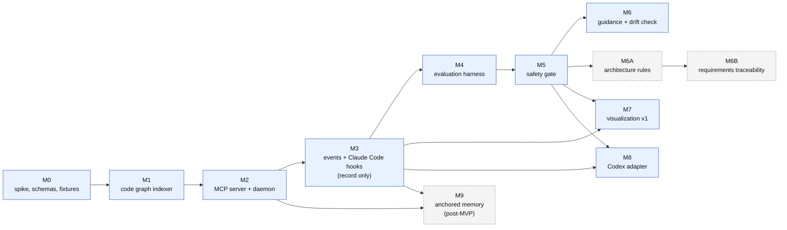

# Diagrams

Source files live in `docs/diagrams/*.mermaid` (the source of truth). This page embeds them so they render on GitHub.
If you change a `.mermaid` file, regenerate this page or update the matching block.

## System overview

Agents talk to thin adapters (hooks) and to the MCP server. All logic lives in one local daemon over two SQLite stores. The repository, including spec files, policy and AGENTS.md, is the only thing humans edit.

## Gated edit: sequence

What happens on one edit: lookup, policy decision, recorded evidence, then post-edit reindex and violation feedback. Any daemon failure or timeout fails open.

## Graph model

Node and edge kinds. Top: derived from code. Bottom: declared intent from spec files (M6A/M6B). Cross links connect the two.

## Storage schema

graph.db (nodes, edges, cached metrics, schema version) and events.db (sessions, prompts, tool calls, decisions, diffs, errors, schema version).

## Policy decision flow

Fail-open first, then every rule's `match` is evaluated; the strongest `on_match` (after engine caps) decides what the agent sees. Every path records evidence.

## Intent and guidance flow

Specs and code feed one read-only graph. AGENTS.md is generated into marked blocks and drift-checked. Agent-suggested links are proposals until a human accepts them into spec files.

## Memory freshness states (M9)

Anchored memories become stale or orphaned when their code changes or disappears.

## Milestone dependencies

Build order. Solid = MVP path, dashed = later.

